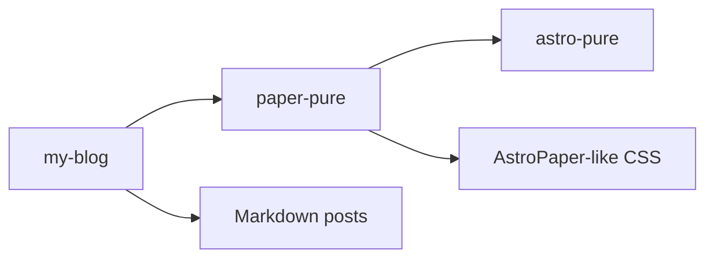

This started from the old `blog/main/src/content/posts/first-note.md` placeholder. The original note was only a few lines, so this version keeps the same purpose and expands it into a markdown rendering sample.

The goal is not to make every feature perfect yet. The goal is to see what works, what renders as plain text, and what breaks.

## Headings

# H1 inside content

## H2 inside content

### H3 inside content

#### H4 inside content

##### H5 inside content

###### H6 inside content

## Paragraph Features

Normal text should be readable. **Bold text**, *italic text*, ***bold italic text***, ~~strikethrough text~~, `inline code`, and [normal links](https://astro.build/) should sit cleanly in a paragraph.

Autolinks should also be visible: https://github.com/marcelofpfelix

Escaped characters should remain literal: \*not italic\* and \`not code\`.

## Images


## Lists

Unordered list:

- keep the site repo mostly content
- keep reusable components in `paper-pure`
- avoid copying a full upstream theme
- keep overrides small and boring

Ordered list:

1. Write the post in `src/content/posts`.
2. Let Astro build the static route.
3. Let the theme package own repeated UI.

Nested list:

- Theme
  - layout
  - post list
  - prose styles
- Site
  - content
  - config
  - minimal pages

Task list:

- [x] base layout
- [x] post layout
- [x] search entry point
- [ ] graph view

## Table

| Feature | Type | Current state |
| --- | --- | --- |
| RSS | feed | working |
| Tags | metadata | shown inside search |
| Archive | index | linked from posts |
| Graph view | roadmap | not built yet |

Right and center alignment:

| Left | Center | Right |
| :--- | :---: | ---: |
| alpha | beta | 10 |
| longer value | middle | 200 |

## Blockquotes

> A good theme should make normal markdown readable before it adds more features.

Nested quote:

> First level
>
> > Second level

## GitHub Alerts

> [!NOTE]  
> Notes should be calm and readable.

> [!TIP]  
> Tips should stand out without becoming noisy.

> [!IMPORTANT]  
> Important text should be easy to scan.

> [!WARNING]  
> Warnings should be visible in both light and dark mode.

> [!CAUTION]  
> Caution blocks should not destroy the page rhythm.

## Code

Inline code like `pnpm build` should not fight the paragraph line-height.

TypeScript with a title and highlighted lines:

```ts title="src/pages/posts/index.astro" {1,4}
import { PaperBaseLayout, PaperPostList } from "paper-pure/components";
import { publishedPosts } from "paper-pure/utils";

const posts = publishedPosts(await getCollection("posts"));
```

Rust:

```rust title="src/main.rs" {1,9-12}
#[derive(Debug, Clone)]
struct Repo {
    owner: String,
    name: String,
}

impl Repo {
    fn slug(&self) -> String {
        format!("{}/{}", self.owner, self.name)
    }
}

fn main() {
    let repo = Repo {
        owner: "marcelofpfelix".into(),
        name: "paper-pure".into(),
    };

    println!("{}", repo.slug());
}
```

Diff with add/remove line styling:

```diff title="paper.css"
- .paper-icon-button:hover {
-   background: var(--paper-panel);
-   border-color: var(--paper-accent);
- }
+ .paper-icon-button:hover {
+   background: transparent;
+   color: var(--paper-accent);
+ }
```

Shell:

```sh
pnpm install
pnpm build
pnpm test:lighthouse
```

## Mermaid



Diagram source links:

[Mermaid source](/diagrams/theme-flow.mmd "Open the Mermaid source file")

[PlantUML source](/diagrams/call-flow.puml "Open the PlantUML source file")

[Excalidraw sketch](/diagrams/sketch.excalidraw "Open the editable Excalidraw file")

## Link Preview

<a class="paper-link-preview" href="https://astro.build/">
  <span>
    <strong>Astro</strong>
    <small>The web framework used by this blog and theme wrapper.</small>
    <em>astro.build</em>
  </span>
</a>

## Footnotes

Footnotes are useful for small asides without breaking the main flow.[^1]

[^1]: This is a GitHub-style footnote.

## Definition List

Theme
: reusable layouts, components, and CSS

Site
: content, config, and route composition

## Details

<details>
<summary>Raw HTML details block</summary>

This checks whether HTML inside markdown keeps spacing and typography.

</details>

## Horizontal Rule

---

The content after the rule should not feel detached from the rest of the post.

## What This Page Should Reveal

If GitHub alerts, Mermaid, footnotes, definition lists, or task lists do not render cleanly, that is useful signal. It means the theme or Astro markdown pipeline needs explicit support instead of pretending the feature works.
